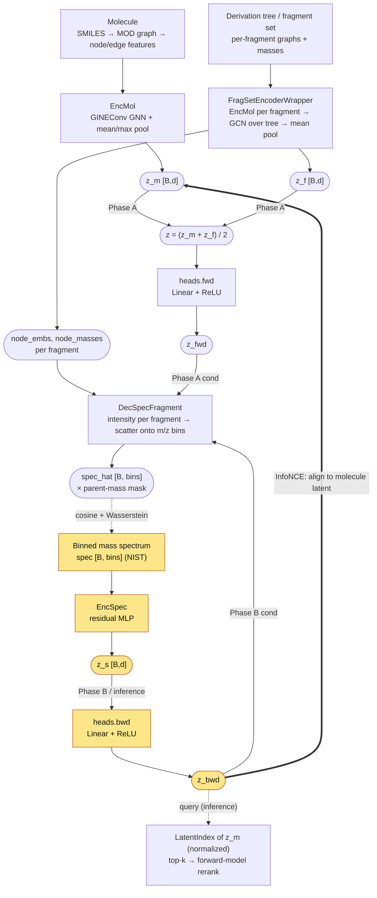

# Model architecture

Dataflow of the spectrum↔molecule model, derived from the actual wiring in
`src/machine_learning/`. Three inputs (molecule graph, fragment/derivation tree,
binned mass spectrum) feed three encoders that share a common latent space; two
task-head projections (`fwd`, `bwd`) and one fragment-grounded decoder
(`DecSpecFragment`) are reused across the forward and backward objectives.

**Short answer to "does the mass spec feed into `heads.bwd`?" — yes.** The
binned spectrum is the *only* input to the backward head: `spec → EncSpec → z_s
→ heads.bwd → z_bwd`. The molecule/fragment side feeds `heads.fwd`.

The highlighted path (`spec → EncSpec → z_s → heads.bwd → z_bwd`) is the
backward branch the question was about.

## Modules

| Module | File | Role |
| --- | --- | --- |
| `EncMol` | [models.py:77](../src/machine_learning/models.py#L77) | Molecule graph → `z_m`. Edge-aware GINEConv GNN with mean+max readout (max-pool keeps the atoms that distinguish constitutional isomers). |
| `FragSetEncoderWrapper` | [fragments.py:12](../src/machine_learning/fragments.py#L12) | Derivation tree → `z_f` plus per-fragment `node_embs`/`node_masses`. Embeds each fragment with `EncMol`, runs a 2-layer GCN over the tree, mean-pools. |
| `EncSpec` | [models.py:128](../src/machine_learning/models.py#L128) | Binned spectrum → `z_s`. Residual MLP. |
| `TaskHeads` | [models.py:244](../src/machine_learning/models.py#L244) | Two Linear+ReLU projections (`fwd`, `bwd`) off the shared latent space, plus learned loss-weight log-variances. |
| `DecSpecFragment` | [models.py:163](../src/machine_learning/models.py#L163) | `(node_embs, node_masses, z_cond) → spec_hat`. Predicts one intensity per fragment and scatters it onto the m/z bin given by that fragment's mass — so every peak lands at a physically realizable mass and the output can't collapse to the dataset mean. |
| `LatentIndex` | [retrieval.py:45](../src/machine_learning/retrieval.py#L45) | Stores normalized `z_m` for every candidate; queried by `z_bwd` at inference. |

## The two heads are not intrinsically bound to an encoder

`TaskHeads.forward(z)` returns `(self.fwd(z), self.bwd(z))` from *whatever*
latent it is handed ([models.py:254](../src/machine_learning/models.py#L254)).
The spec→`bwd` and mol/frag→`fwd` coupling lives entirely at the call sites, not
inside the module:

- **Phase A — forward (molecule + fragments → spectrum).**
  `z = (z_m + z_f)/2`; `z_fwd = heads.fwd(z)`; `spec_hat = dec_spec(node_embs, node_masses, z_fwd)`.
  `EncSpec` is frozen (`.eval()`) here and used only for a cycle-consistency term.
  See [training.py:54-90](../src/machine_learning/training.py#L54-L90).
- **Phase B — backward (spectrum → molecule latent).**
  `z_s = enc_spec(spec)`; **`_, z_bwd = heads(z_s)`**; `L_con = InfoNCE(z_bwd, z_m)`
  aligns the spectrum-derived query to the molecule latent, and
  `spec_hat = dec_spec(node_embs, node_masses, z_bwd)` reconstructs the spectrum
  conditioned on that same `z_bwd` (using the paired molecule's fragments, which
  are available at train time). See [training.py:138-166](../src/machine_learning/training.py#L138-L166).
- **Inference — spectrum → molecule retrieval.**
  `z_bwd = heads.bwd(enc_spec(spec))`, normalized, queries the `LatentIndex` of
  molecule latents; the top-k are reranked by running the forward model on each
  candidate. See [retrieval.py:218-224](../src/machine_learning/retrieval.py#L218-L224)
  and the evaluation path at [evaluation.py:159](../src/machine_learning/evaluation.py#L159).
